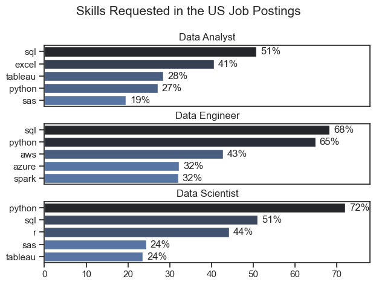
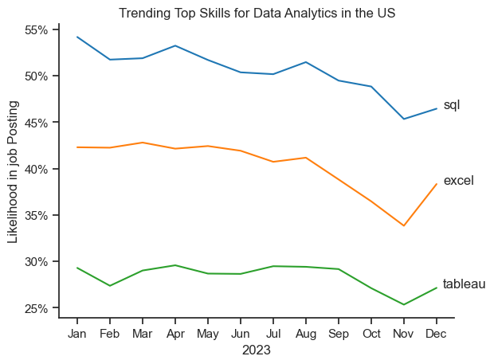
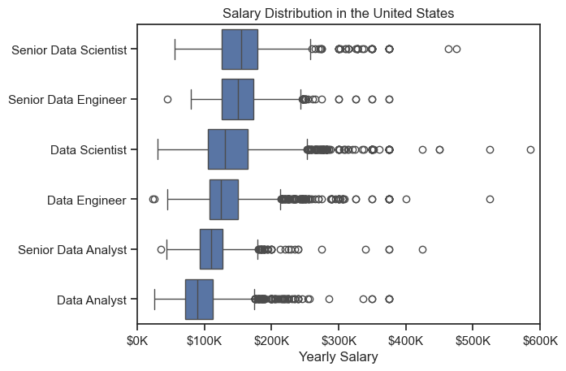
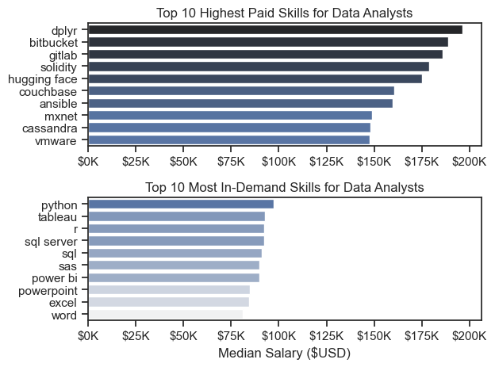
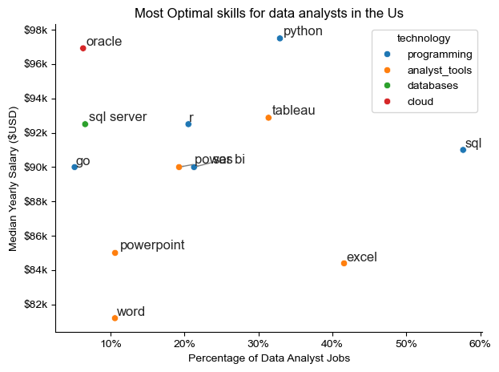

# 📊 Data Analyst Job Market Trends – Python Project

This project explores the U.S. data job market with a focus on **Data Analyst roles**, using Python to uncover trends in salaries, in-demand skills, and optimal technologies to learn. The dataset is sourced from [Luke Barousse’s job market dataset](https://lukebarousse.com/python) and analyzed through a series of Jupyter notebooks.

The goal is to guide aspiring and current data professionals in understanding which skills are most in-demand and best compensated.

---

## 🧠 Project Overview

This project answers key questions:

- 🔍 What are the most in-demand skills for the top 3 data roles?
- 📈 How are those skills trending in 2023 for Data Analysts?
- 💰 Which skills and roles offer the highest salaries?
- 🎯 What are the **most optimal skills** (high demand + high salary) for Data Analysts?

---

## 🛠️ Tools & Technologies

- **Python**
  - `pandas` – data manipulation  
  - `seaborn`, `matplotlib` – data visualization
- **Jupyter Notebook** – data exploration
- **Visual Studio Code** – development environment
- **Git & GitHub** – version control & sharing

---

## 📂 Dataset

- **Source**: [Luke Barousse’s Python Course Dataset](https://lukebarousse.com/python) via Hugging Face
- **Focus**: U.S.-based job postings for data roles  
- **Fields**: Job title, salary, location, posting date, required skills

---

## 📌 Key Tasks Performed

- Data import & cleanup using pandas
- Filtering job postings for U.S. roles
- Skill frequency and trend analysis
- Salary analysis using box plots and bar charts
- Identifying high-paying and high-demand skills
- Scatter plots to find optimal skills to learn
- Technology categorization (e.g., programming, visualization)

---

## 📊 Visuals & Insights

### 🔹 Most Demanded Skills for Top Data Roles

> SQL and Python are consistently the most in-demand across Data Analyst, Data Scientist, and Data Engineer roles.

---

### 🔹 Skill Trends in 2023 for Data Analysts

> Excel surged in demand later in 2023, surpassing Python and Tableau.

---

### 🔹 Salary Distributions by Role

> Senior roles have wider salary ranges and higher median pay.

---

### 🔹 Top Paid vs Most Demanded Skills for Data Analysts

> Tools like `Gitlab`, `dplyr`, and `Oracle` are high-paying, while Excel, SQL, and PowerPoint are most in-demand.

---

### 🔹 Optimal Skills to Learn (High Pay + High Demand)

> Skills like Python, Tableau, and SQL Server strike a good balance between demand and compensation.

---

## 🧠 Skills Gained

- Data Cleaning & Transformation (pandas)
- Visualization (matplotlib, seaborn)
- Trend Analysis & Salary Insights
- Technology Categorization
- Data Storytelling & Interpretation
- Career-Focused Analytical Thinking

---

## ✅ Conclusion

This project provided valuable insight into the evolving U.S. data job market. It emphasized the need to balance **foundational skills** like SQL, Python and Excel with **high-paying specialized tools** like GitLab and Oracle. This analysis is a useful roadmap for anyone aiming to make strategic, data-driven decisions in their data analytics career.

---

